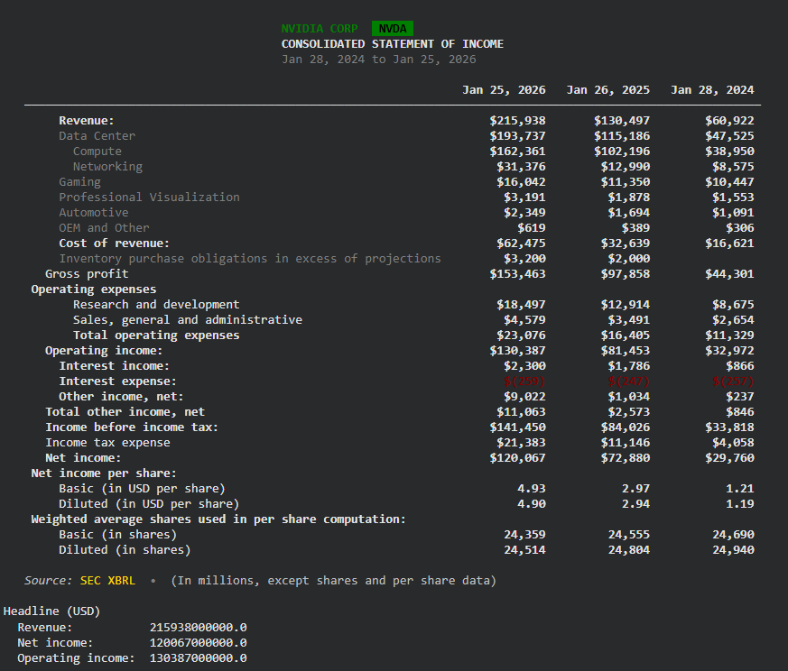

# Finpipe
Free Python library to fetch all the available free market data from most providers


#LIBRARY UNDER CONSTRUCTION!!!
## Authors

| Role | GitHub |
|------|--------|
| Code & Maintenance | [@patramanis](https://github.com/patramanis) |
| Architecture | [@mwkosp](https://github.com/mwkosp) |


- Supporting most of the data for categories: Technicals, Fundamentals, Futures-Options(limited), tick data, Macroeconomic data, RSS feeds and more..
- Rate limiting avoidance support.
- providers fallback support


Easy python API endpoint access for free.
install:
```
uv add finpipe
```
use:
```
from edgar import set_identity
from finpipe.fundamentals.financials import show


set_identity("youremail@gmail.com")
show("NVDA", "income", headlines=True)
```
output:


this library uses the uv package manager.


# finpipe — Provider Map

> 5 modules · 43 providers · 100% free tiers only

-----

## 1. TECHNICALS

|Provider                   |Data                                                   |Key Required          |
|---------------------------|-------------------------------------------------------|----------------------|
|`yfinance`                 |OHLCV stocks/ETF/FX/crypto, pre/post market, L1 bid/ask|No                    |
|`finnhub`                  |OHLCV stocks + crypto, real-time WebSocket stream      |Free key              |
|`polygon`                  |OHLCV stocks (15min delayed free), tape volume         |Free key              |
|`ccxt`                     |OHLCV + order book L2 + trades, 100+ crypto exchanges  |No (public endpoints) |
|`ccxt.pro`                 |WebSocket streaming crypto OHLCV + order book          |Exchange-dependent    |
|`CoinGecko`                |Aggregated crypto OHLCV + volume across all exchanges  |No                    |
|`binance-futures-connector`|Binance spot + futures OHLCV, live liquidation stream  |No (public)           |
|`tardis-python`            |Tick-level crypto trades + order book history          |Free (1 exchange, 1mo)|
|`ib_insync`                |Stocks/futures/options L2 order book + streaming       |Needs IB account      |

**Fallback chains:**

```
Stocks OHLCV:     yfinance → finnhub → polygon
Crypto OHLCV:     ccxt → CoinGecko
Stock streaming:  finnhub WebSocket
Crypto streaming: ccxt.pro → binance-futures-connector
Order book stock: ib_insync (needs account)
Order book crypto: ccxt
Tick crypto:      tardis-python
```

-----

## 2. FUNDAMENTALS

|Provider              |Data                                                                                                                            |Key Required       |
|----------------------|--------------------------------------------------------------------------------------------------------------------------------|-------------------|
|`yfinance`            |Income stmt, balance sheet, cash flow, ratios, earnings, dividends, splits, short interest, ESG, insider, institutional, analyst|No                 |
|`simfinapi`           |Income stmt, balance sheet, cash flow — bulk US market download                                                                 |Free key (2000/day)|
|`fmpsdk`              |Full statements, ratios, key metrics, Piotroski, earnings, analyst, insider, 13F, profile                                       |Free key (250/day) |
|`finnhub`             |Ratios, earnings calendar, EPS estimates, analyst recs, insider MSPR, ESG, congressional trades                                 |Free key (60/min)  |
|`SEC EDGAR API`       |XBRL-structured financials, all public US companies, all filings                                                                |No                 |
|`sec-edgar-downloader`|Raw 10-K, 10-Q, 8-K, DEF14A, S-1, Form 4, SC 13D/G                                                                              |No                 |

**Fallback chains:**

```
Statements:           yfinance → simfinapi → fmpsdk → SEC EDGAR API
Ratios:               yfinance → finnhub → fmpsdk
Earnings/estimates:   finnhub → yfinance → fmpsdk
Analyst/targets:      finnhub → yfinance → fmpsdk
Insider:              finnhub → fmpsdk → sec-edgar-downloader (Form 4)
Institutional 13F:    yfinance → fmpsdk
Dividends/splits:     yfinance → fmpsdk
Short interest:       yfinance → finnhub
ESG:                  yfinance → finnhub
Filings (raw):        sec-edgar-downloader → SEC EDGAR API (XBRL)
Profile/metadata:     fmpsdk → finnhub → yfinance
```

-----

## 3. MACRO

|Provider           |Data                                                                                                    |Key Required       |
|-------------------|--------------------------------------------------------------------------------------------------------|-------------------|
|`fredapi`          |500k+ US series: rates, yields, CPI, PCE, GDP, M1/M2, Fed balance sheet, housing, spreads, FX, VIX, AAII|Free key           |
|`BLS API`          |CPI by component, PPI by industry, employment by sector/state/demographic                               |Free key (3000/day)|
|`BEA API`          |GDP components, PCE, national accounts, state GDP — first release                                       |Free key           |
|`pandas-datareader`|FRED mirror, Fama-French factors (1926+), World Bank, OECD, Eurostat                                    |No                 |
|`wbgapi`           |16,000+ World Bank indicators, 200+ countries                                                           |No                 |
|`OECD API`         |MEI, QNA, CLI (composite leading indicators), OECD member countries                                     |No                 |
|`eurostat`         |EU/Eurozone GDP, HICP, unemployment, ECB rates, gov debt                                                |No                 |
|`IMF API`          |WEO: GDP/CPI/unemployment/debt 190 countries + forecasts, IFS monthly                                   |No                 |
|`OpenBB`           |Unified router: FRED, World Bank, OECD, ECB, IMF in one interface                                       |No                 |
|`Nasdaq Data Link` |CFTC COT positioning (1986+), CME CHRIS futures, EIA oil, IMF commodity prices                          |Free key           |
|`pytrends`         |Google Trends — retail attention/search volume as macro signal                                          |No                 |

**Fallback chains:**

```
US rates/yields/spreads:    fredapi
US inflation granular:      BLS API → fredapi
US GDP first release:       BEA API → fredapi
US employment granular:     BLS API → fredapi
Money supply/Fed BS:        fredapi
Housing/sentiment:          fredapi
FX rates:                   fredapi → yfinance
Fama-French factors:        pandas-datareader (Ken French direct)
CFTC COT:                   Nasdaq Data Link
Commodity prices:           Nasdaq Data Link → fredapi
Multi-country GDP/CPI:      IMF API → wbgapi
EU/Eurozone:                eurostat → OpenBB
OECD + CLI:                 OECD API → pandas-datareader
Unified quick pulls:        OpenBB
Google Trends:              pytrends
```

-----

## 4. DERIVATIVES

|Provider                   |Data                                                                                      |Key Required          |
|---------------------------|------------------------------------------------------------------------------------------|----------------------|
|`OpenBB`                   |Equity options chain + greeks (CBOE), futures curves all expiries                         |No                    |
|`tradier`                  |Equity options chain + greeks + historical contract OHLCV, streaming                      |Free dev account      |
|`yfinance`                 |Equity options snapshot (no greeks)                                                       |No                    |
|`py_vollib_vectorized`     |Local greeks computation — entire chain at once                                           |No                    |
|`mibian`                   |Local Black-Scholes pricing + IV solve                                                    |No                    |
|`Nasdaq Data Link`         |Traditional futures CHRIS/CME: OHLCV + OI + volume, continuous contracts                  |Free key              |
|`ccxt`                     |Crypto perps + dated futures: OHLCV, funding rate history, OI history, mark price         |No                    |
|`binance-futures-connector`|Binance futures: OI history (30d), funding history, live liq stream                       |No                    |
|`pybit`                    |Bybit futures: OI, funding, insurance fund                                                |No                    |
|`CoinGlass`                |Aggregated across 30+ exchanges: OI, funding, liquidations (2019+), liq heatmap, L/S ratio|Free key (300/day)    |
|`Deribit API`              |Crypto options: full chain + greeks + IV surface + historical OHLCV per contract          |No                    |
|`tardis-python`            |Historical crypto options chain snapshots + tick trades                                   |Free (1mo, 1 exchange)|

**Fallback chains:**

```
Equity options chain+greeks:    OpenBB (CBOE) → tradier
Equity options snapshot:        yfinance (no greeks)
Historical contract OHLCV:      tradier → polygon
Greeks (local compute):         py_vollib_vectorized → mibian
Max pain / GEX / PCR:           compute from chain data
Traditional futures front-month: yfinance
Traditional futures curve:      OpenBB (CBOE) → Nasdaq Data Link CHRIS
Crypto perps OHLCV+funding+OI:  ccxt → binance-futures-connector → pybit
Crypto funding aggregated:      CoinGlass
Crypto OI aggregated:           CoinGlass
Crypto liquidations historical: CoinGlass (2019+, hourly, long vs short)
Crypto liq heatmap (levels):    CoinGlass
Crypto long/short ratio:        CoinGlass
Live liq stream:                binance-futures-connector WebSocket → pybit
Crypto options full:            Deribit API direct
Crypto options historical:      tardis-python (1mo free)
```

-----

## 5. SENTIMENT & NEWS

|Provider              |Data                                                                                               |Key Required       |
|----------------------|---------------------------------------------------------------------------------------------------|-------------------|
|`finnhub`             |News sentiment scored, buzz, social (Reddit+Twitter aggregated), insider MSPR, congressional trades|Free key (60/min)  |
|`marketaux`           |News + per-entity sentiment score, 50+ sources, ticker-tagged                                      |Free key (100/day) |
|`alpha_vantage`       |News + sentiment score per article per ticker, topic filter                                        |Free key (25/day)  |
|`feedparser`          |RSS: Reuters, FT, CNBC, MarketWatch, Fed, ECB, IMF, SEC filings — unlimited                        |No                 |
|`newsapi`             |General financial news, 1 month history, 100 sources                                               |Free key (100/day) |
|`newspaper4k`         |Full article text extraction from any URL                                                          |No                 |
|`GDELT`               |Global news tone (AvgTone −100/+100), 65 languages, 15min refresh, 2015+                           |No                 |
|`praw`                |Reddit: r/wallstreetbets, r/stocks, r/options, r/investing — streaming + search                    |Free key           |
|`StockTwits API`      |Bullish/Bearish user tags per ticker, trending symbols                                             |No (200/hr)        |
|`CryptoPanic`         |Crypto news 50+ sources, community votes as sentiment signal                                       |Free key (1000/day)|
|`SEC EDGAR RSS`       |Real-time 8-K, Form 4, SC 13D as filed                                                             |No                 |
|`sec-edgar-downloader`|Bulk filings as events (earnings transcripts via 8-K exhibits)                                     |No                 |
|`CNN Fear&Greed`      |Composite index 0-100 + 7 components + history                                                     |No                 |
|`fredapi`             |AAII bull/bear survey (weekly, 1987+)                                                              |Free key           |
|`Nasdaq Data Link`    |CFTC COT net speculator position as sentiment                                                      |Free key           |
|`pytrends`            |Google Trends retail attention signal                                                              |No                 |
|`Glassnode`           |On-chain: active addresses, exchange netflow, tx count (free tier)                                 |Free key           |
|`CoinGlass`           |Crypto: funding rate sentiment, long/short ratio, top trader ratio                                 |Free key (300/day) |
|`FinBERT`             |Local NLP: finance-specific sentiment (positive/negative/neutral)                                  |No (local)         |
|`VADER`               |Local NLP: fast rule-based, best for social/informal text                                          |No (local)         |
|`bart-large-mnli`     |Local NLP: zero-shot custom labels (hawkish/dovish, risk-on/off)                                   |No (local)         |

**Fallback chains:**

```
News pre-scored:          finnhub → marketaux → alpha_vantage
News raw headlines:       feedparser RSS → newsapi → polygon
Full article text:        newspaper4k (any URL)
Global news tone:         GDELT
Reddit sentiment:         praw → finnhub social (aggregated)
StockTwits:               StockTwits API (no key)
Crypto news:              CryptoPanic → finnhub crypto
Filings as events:        SEC EDGAR RSS (real-time) → sec-edgar-downloader
Earnings transcripts:     finnhub → sec-edgar-downloader (8-K exhibits)
Behavioral — PCR:         compute from OpenBB/tradier chain
Behavioral — AAII:        fredapi
Behavioral — COT:         Nasdaq Data Link
Behavioral — Fear&Greed:  CNN direct API
Behavioral — VIX term:    yfinance + fredapi
Behavioral — Google:      pytrends
On-chain crypto:          Glassnode free tier
Crypto derivatives sent:  CoinGlass (funding + L/S ratio)
NLP finance:              FinBERT (local, no cost)
NLP social/informal:      VADER (local, no cost)
NLP zero-shot:            bart-large-mnli (local, no cost)
```

-----

## Full Provider List (43 total)

```
# Data APIs
yfinance                simfinapi               fmpsdk
finnhub                 polygon                 alpha_vantage
SEC EDGAR API           sec-edgar-downloader    fredapi
BLS API                 BEA API                 pandas-datareader
wbgapi                  OECD API                eurostat
IMF API                 OpenBB                  Nasdaq Data Link
ccxt                    ccxt.pro                CoinGecko
binance-futures-connector  pybit               tardis-python
ib_insync               CoinGlass               Deribit API
tradier                 marketaux               newsapi
feedparser              newspaper4k             GDELT
praw                    StockTwits API          CryptoPanic
CNN Fear&Greed          Glassnode               pytrends

# Local compute (no API)
py_vollib_vectorized    mibian
FinBERT                 VADER                   bart-large-mnli
```

-----

## Keys Summary

|Needed for full coverage                                     |Truly optional                        |
|-------------------------------------------------------------|--------------------------------------|
|`fredapi` — strongly recommended, free at fred.stlouisfed.org|`ib_insync` — needs IB account        |
|`finnhub` — free at finnhub.io                               |`tardis-python` — 1mo free only       |
|`fmpsdk` — free at financialmodelingprep.com                 |`ccxt.pro` — exchange-dependent       |
|`polygon` — free at polygon.io                               |`alpha_vantage` — 25/day barely useful|
|`CoinGlass` — free at coinglass.com                          |                                      |
|`tradier` — free dev account at tradier.com                  |                                      |
|`CryptoPanic` — free at cryptopanic.com                      |                                      |
|`Glassnode` — free at glassnode.com                          |                                      |
|`BLS` — free at bls.gov/developers                           |                                      |
|`BEA` — free at bea.gov                                      |                                      |
|`Nasdaq Data Link` — free at data.nasdaq.com                 |                                      |
|`newsapi` — free at newsapi.org                              |                                      |
|`marketaux` — free at marketaux.com                          |                                      |
|`simfinapi` — free at simfin.com                             |                                      |


> Zero-config minimum: `yfinance` + `ccxt` + `fredapi` + `SEC EDGAR` covers ~60% of all data types with no keys at all.
